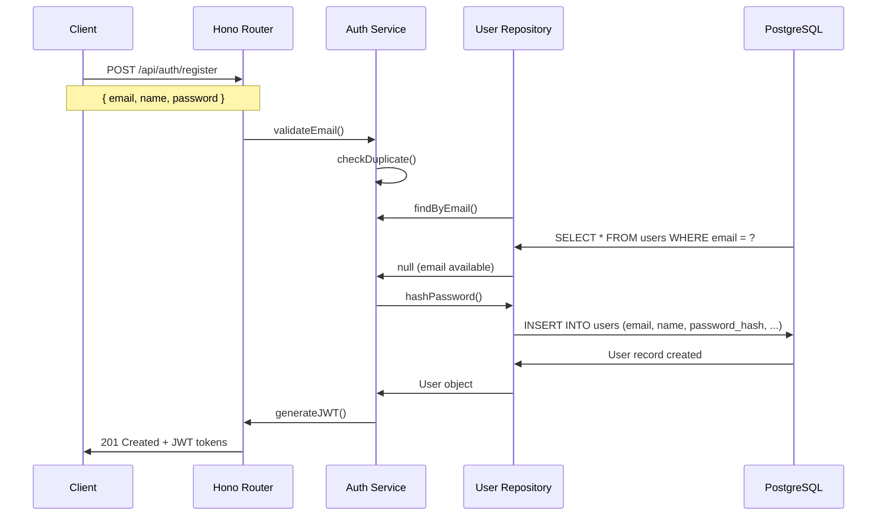
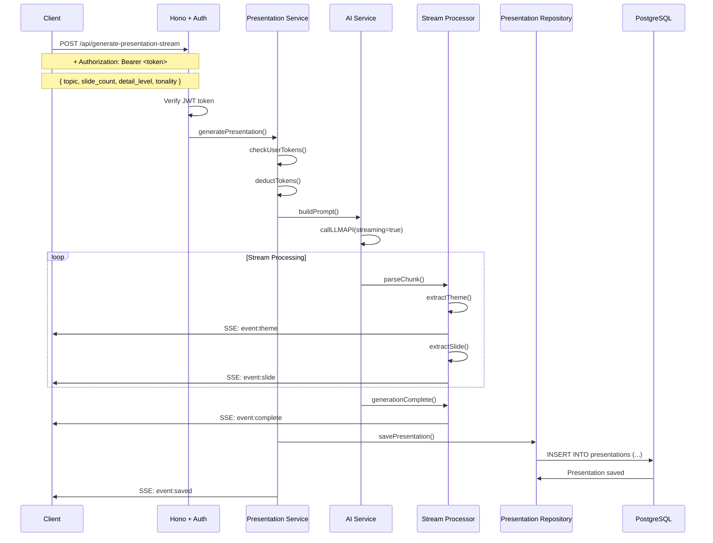
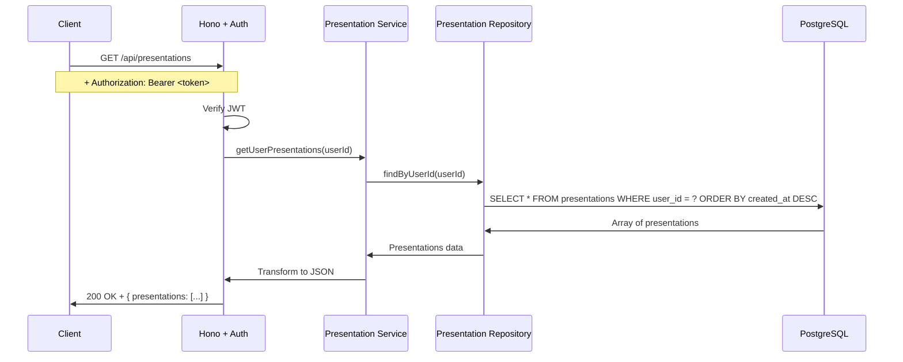
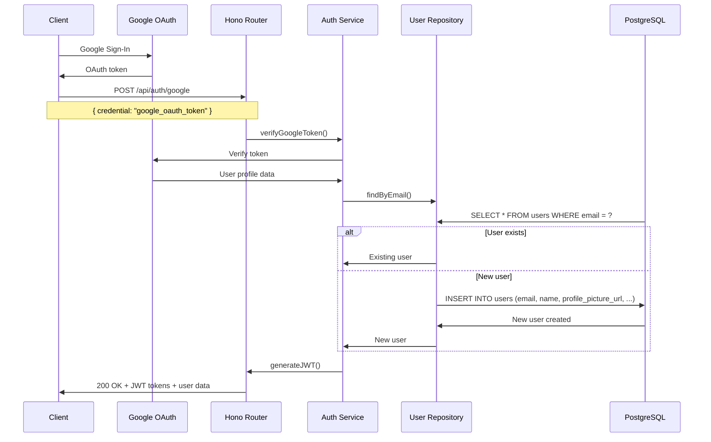
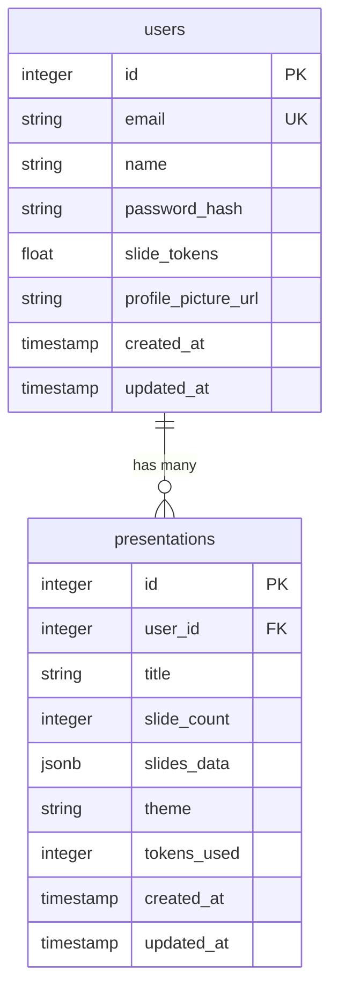
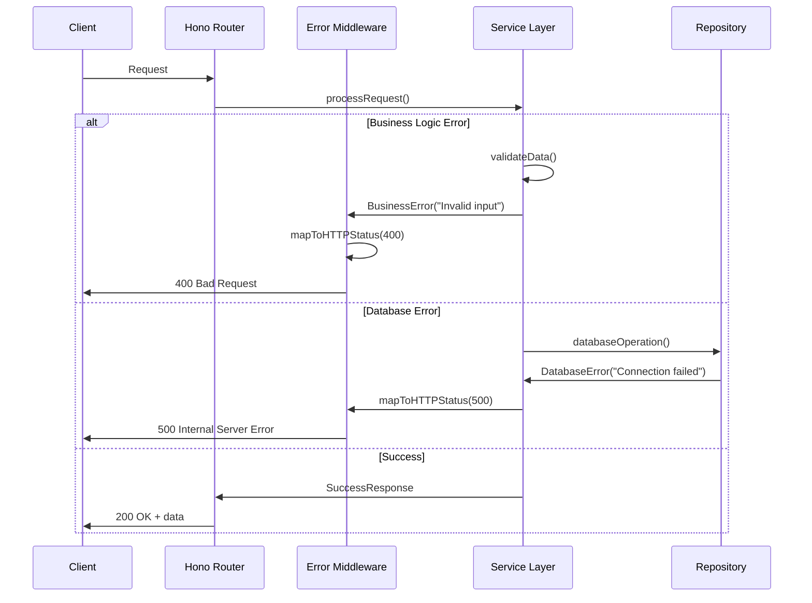

# Request Flows

Detailed request flow diagrams for SlideSage application endpoints.

## User Registration Flow

## Presentation Generation Flow (SSE)

## Get Presentations Flow

## Google OAuth Flow

## Database Schema Relationships

## Error Handling Flow

## Performance Considerations

### Caching Strategy

- **Turbo Cache**: Build artifacts cached by file dependencies
- **Database Queries**: Frequently accessed data cached in memory
- **API Responses**: Static responses cached with appropriate TTL

### Parallel Processing

- **Build Tasks**: Multiple apps built simultaneously when possible
- **API Requests**: Non-blocking I/O operations
- **Slide Generation**: Stream processing for real-time updates

### Resource Management

- **Connection Pooling**: Database connections reused efficiently
- **Memory Optimization**: Lightweight runtime (Bun vs Node.js)
- **Request Batching**: Multiple operations combined when possible

For backend architecture details, see [BACKEND_ARCHITECTURE.md](BACKEND_ARCHITECTURE.md).
