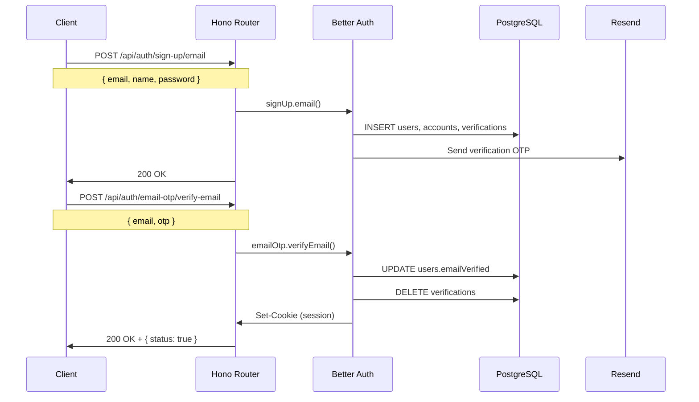
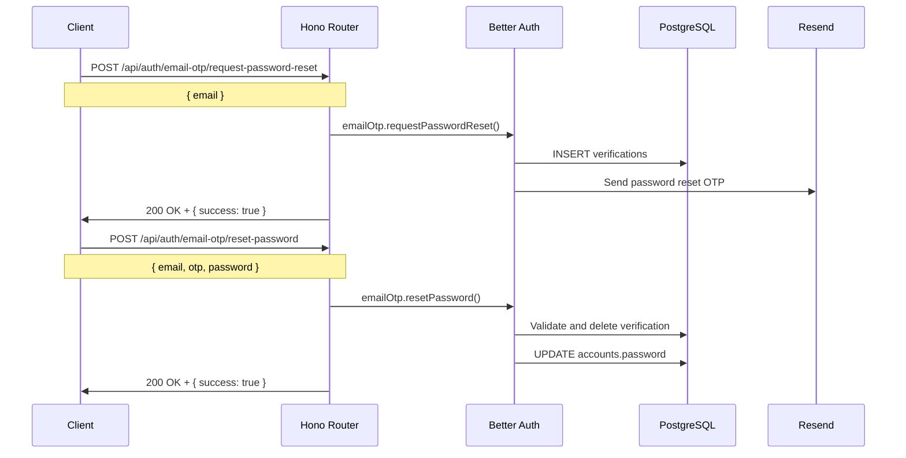
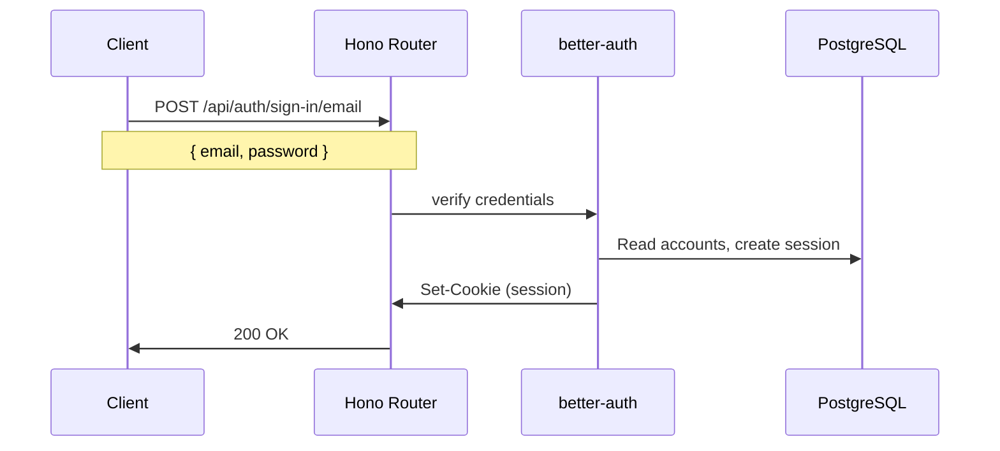
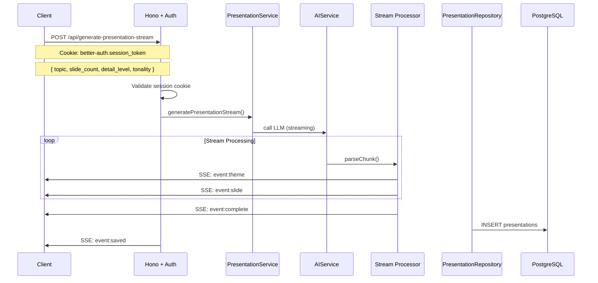
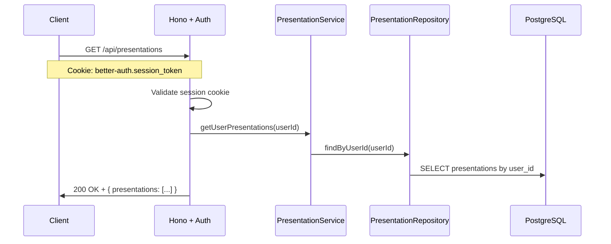
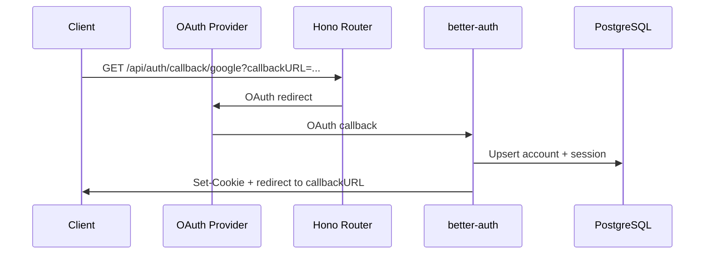
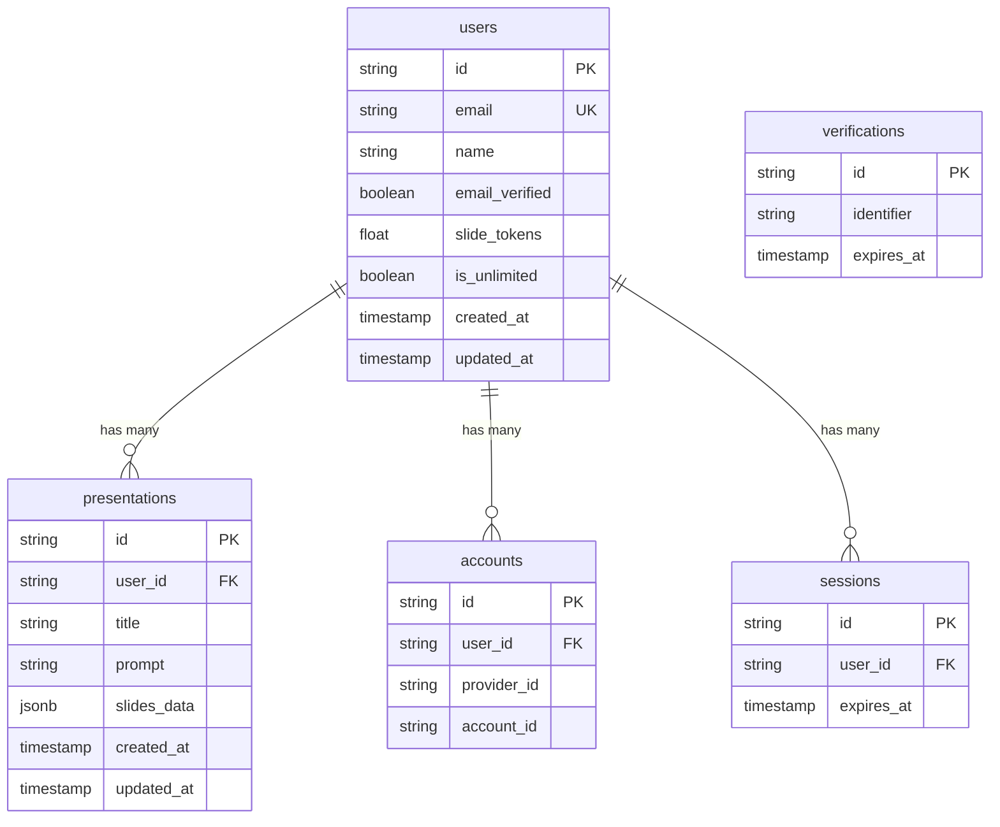

# Request Flows

Request flow diagrams for key SlideSage endpoints.

## Email Sign-up and Verification Flow

## Forgot Password OTP Flow

## Email Sign-in Flow

## Presentation Generation Flow (SSE)

## Get Presentations Flow

## OAuth Flow (Google or GitHub)

## Database Schema Relationships

For APIs architecture details, see [APIs_ARCHITECTURE.md](APIs_ARCHITECTURE.md).
